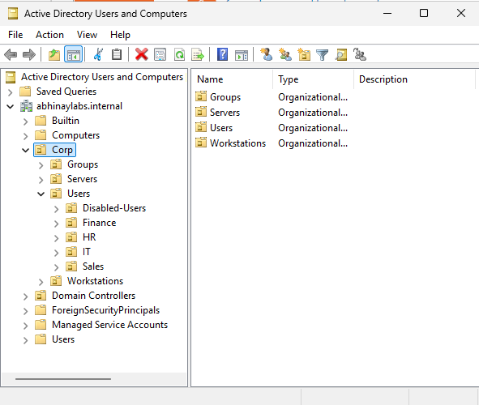
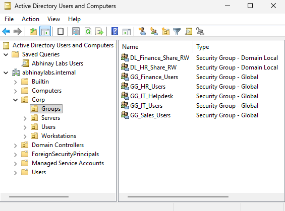
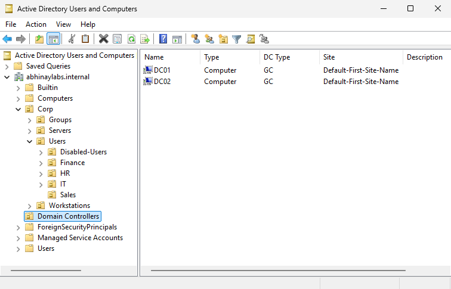
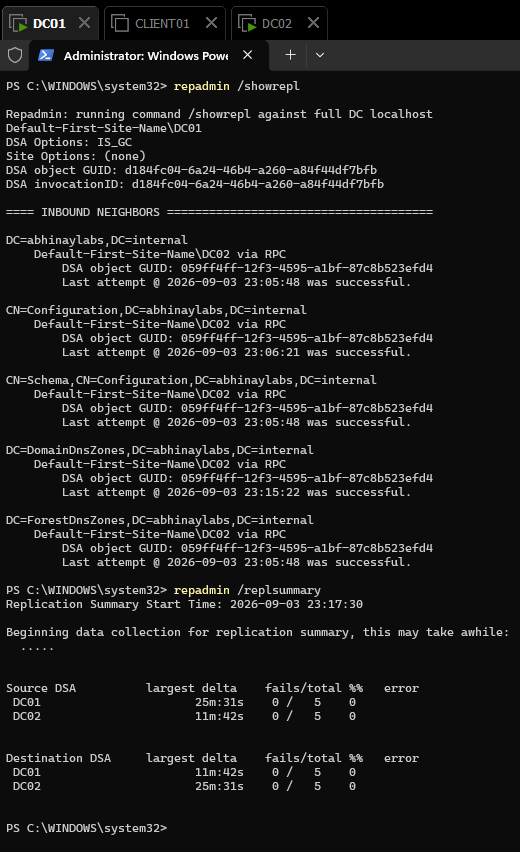
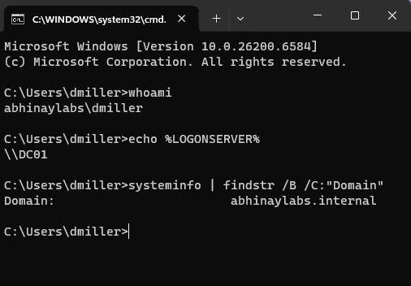
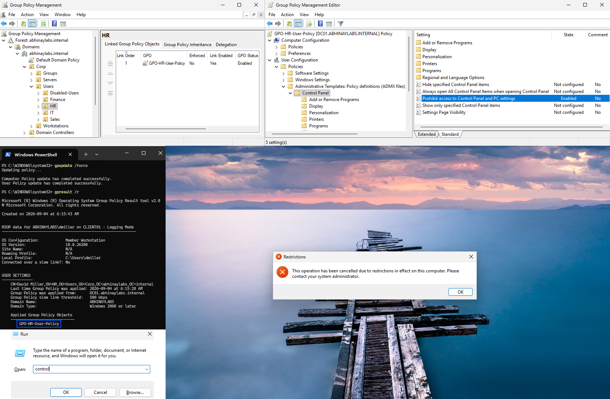
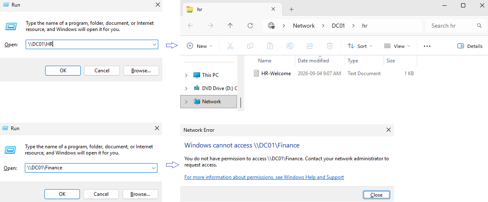
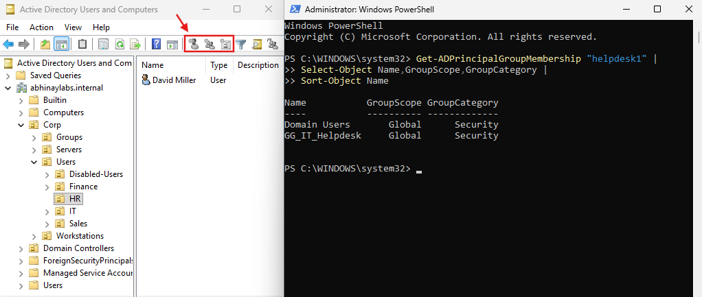
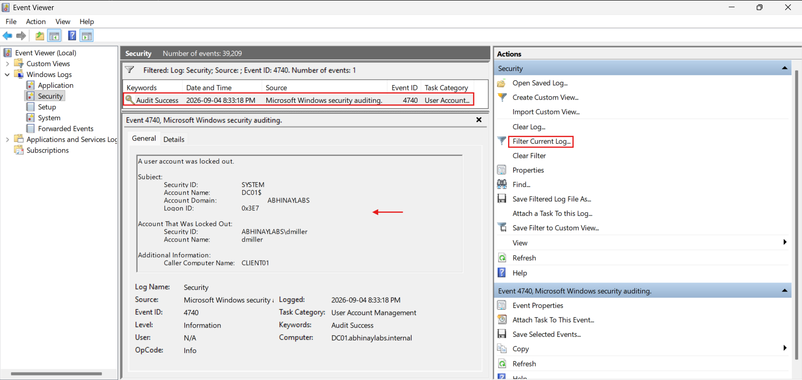
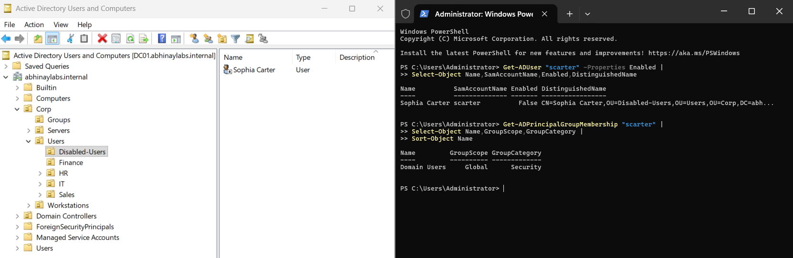

# Active Directory IT Support Home Lab

A multi-server Windows Active Directory home lab designed to simulate common enterprise **IT Support, Service Desk, identity administration, access control, and troubleshooting workflows**.

The environment was built in VMware Workstation using Windows Server 2025 and Windows 11 and includes two domain controllers, Active Directory-integrated DNS, Group Policy, AGDLP-based resource permissions, delegated Help Desk administration, account troubleshooting, and employee onboarding/offboarding.

> **Lab Notice:** Abhinay Labs is a fictional organization created solely for this simulated enterprise IT environment. All identities and data used in the project are synthetic.

---

## Project Overview

The goal of this project was to move beyond basic Active Directory installation and build a small enterprise-style environment where I could practice the tasks commonly performed by IT Support and Service Desk teams.

The project covers the lifecycle of an Active Directory environment from initial network design through final validation:

- Windows Server deployment
- Active Directory Domain Services (AD DS)
- Active Directory-integrated DNS
- Two writable domain controllers
- Active Directory replication
- Organizational Unit design
- User and security group administration
- AGDLP-based authorization
- Windows 11 domain joining
- Domain-user authentication
- Group Policy
- Departmental SMB file shares
- Delegated Help Desk administration
- Least-privilege access
- Password resets and account lockouts
- Windows authentication-event investigation
- Employee onboarding and offboarding
- DNS and service-connectivity troubleshooting
- Active Directory replication troubleshooting
- End-to-end environment validation

---

## Lab Architecture

```text
                           Internet
                              |
                              v
                    VMware NAT Gateway
                      192.168.170.2
                              |
                              v
                  VMnet8 192.168.170.0/24
                              |
              +---------------+---------------+
              |                               |
              v                               v
            DC01                            DC02
       192.168.170.10                  192.168.170.11
       Windows Server                  Windows Server
       AD DS + DNS                     AD DS + DNS
       File Shares                     Global Catalog
              |                               |
              +-------- Replication ----------+
                              |
                              v
                           CLIENT01
                       192.168.170.20
                         Windows 11
                              |
                 Domain-Joined Workstation
```

### Environment

| System       | Role                                                     | IPv4 Address     |
| ------------ | -------------------------------------------------------- | ---------------- |
| **DC01**     | Domain Controller, AD DS, DNS, lab file-share host       | `192.168.170.10` |
| **DC02**     | Additional Domain Controller, AD DS, DNS, Global Catalog | `192.168.170.11` |
| **CLIENT01** | Windows 11 domain workstation                            | `192.168.170.20` |

**Domain**

```text
abhinaylabs.internal
```

**NetBIOS domain**

```text
ABHINAYLABS
```

**CLIENT01 DNS**

```text
Preferred:  192.168.170.10
Alternate:  192.168.170.11
```

---

## Technologies and Tools

### Microsoft / Windows

- Windows Server 2025
- Windows 11 Enterprise Evaluation
- Active Directory Domain Services
- Active Directory Users and Computers
- Active Directory Administrative Center
- DNS Server
- Group Policy Management
- Windows Event Viewer
- Server Manager
- RSAT
- SMB file sharing

### Administration and Troubleshooting

- PowerShell
- Command Prompt
- `repadmin`
- `dcdiag`
- `nltest`
- `gpupdate`
- `gpresult`
- `Test-NetConnection`
- `Resolve-DnsName`
- `nslookup`
- `net use`
- Active Directory PowerShell cmdlets

### Infrastructure / Documentation

- VMware Workstation
- Git
- GitHub
- Visual Studio Code
- Markdown

---

# Key Project Highlights

## 1. Enterprise-Style Active Directory Structure

I created a structured OU hierarchy to separate users, workstations, groups, servers, and disabled accounts.

```text
abhinaylabs.internal
├── Corp
│   ├── Groups
│   ├── Servers
│   ├── Users
│   │   ├── Disabled-Users
│   │   ├── Finance
│   │   ├── HR
│   │   ├── IT
│   │   └── Sales
│   └── Workstations
└── Domain Controllers
```

This structure provided logical administrative boundaries for Group Policy, user administration, workstation management, and employee lifecycle operations.



---

## 2. Users, Security Groups, and AGDLP

Synthetic employees were created for multiple departments:

| Department | Employee       | Username  |
| ---------- | -------------- | --------- |
| HR         | David Miller   | `dmiller` |
| Finance    | Elena Rivera   | `erivera` |
| Sales      | Joseph Daniel  | `jdaniel` |
| IT         | Pauline Hudson | `phudson` |

Department Global groups included:

```text
GG_HR_Users
GG_Finance_Users
GG_Sales_Users
GG_IT_Users
GG_IT_Helpdesk
```

Resource Domain Local groups included:

```text
DL_HR_Share_RW
DL_Finance_Share_RW
```

Access was designed using **AGDLP**:

```text
Accounts
   ↓
Global Groups
   ↓
Domain Local Groups
   ↓
Permissions
```

Example:

```text
David Miller
      ↓
GG_HR_Users
      ↓
DL_HR_Share_RW
      ↓
HR Share Permissions
```

This avoids assigning departmental resource permissions directly to individual users.



---

## 3. Redundant Domain Controllers and DNS

DC01 was initially deployed as the first domain controller.

DC02 was later added as a second writable domain controller with:

- Active Directory Domain Services
- DNS
- Global Catalog
- Active Directory replication

This allowed the lab to practice replication monitoring, redundant domain DNS, and controlled domain-controller failover.

```text
DC01
  ⇅
Active Directory Replication
  ⇅
DC02
```

CLIENT01 uses both domain DNS servers:

```text
Preferred DNS: 192.168.170.10
Alternate DNS: 192.168.170.11
```





---

## 4. Windows 11 Domain Join and Authentication

CLIENT01 was configured as a Windows 11 domain workstation and joined to:

```text
abhinaylabs.internal
```

Domain authentication was validated using a synthetic HR employee account.

Commands such as:

```cmd
whoami
echo %LOGONSERVER%
nltest /dsgetdc:abhinaylabs.internal
```

were used to validate the authenticated domain identity, logon server, and domain-controller discovery.



---

## 5. Group Policy Administration

Group Policy was used to implement domain, workstation, and department-specific configuration.

The lab included:

- Domain password policy
- Account lockout policy
- Workstation security policy
- Interactive logon configuration
- HR user restrictions
- HR mapped-drive configuration

The domain account policy included:

```text
Minimum password length:       12
Password history:              24
Password complexity:           Enabled
Account lockout threshold:     5
Account lockout duration:      15 minutes
Lockout counter reset:         15 minutes
```

Group Policy processing was validated using:

```cmd
gpupdate /force
gpresult /r
```

The HR-specific user GPO was also validated directly from CLIENT01.



---

## 6. Departmental File Shares and Authorization

Departmental SMB resources were created for:

```text
\\DC01\HR
\\DC01\Finance
```

Access was controlled using both:

- Share permissions
- NTFS permissions

and assigned through the AGDLP group model.

For the HR user:

```text
David Miller
      ↓
GG_HR_Users
      ↓
DL_HR_Share_RW
      ↓
\\DC01\HR
```

Validation confirmed:

```text
HR Share       → Allowed
Finance Share  → Denied
```

This demonstrated the difference between **authentication** and **authorization**: successfully signing into the domain does not automatically grant access to every resource.



The HR resource was also mapped through Group Policy as:

```text
H: → \\DC01\HR
```

---

## 7. Least-Privilege Help Desk Delegation

A dedicated Help Desk account and security group were configured without granting Domain Admin privileges.

```text
helpdesk1
    ↓
GG_IT_Helpdesk
```

The Help Desk group received delegated permissions over the user OU for password-reset operations.

The implementation demonstrated that the Help Desk role could perform its required support function while remaining restricted from broader administrative operations.

Validation included:

```text
Password reset     → Allowed
Create domain user → Denied
Domain Admin       → No
```



This demonstrates the security principle of:

> Grant only the permissions required to perform the assigned job function.

---

## 8. Account Lockout and Authentication Troubleshooting

A controlled account-lockout scenario was created using the synthetic HR user.

The investigation included Windows authentication and account-management events such as:

```text
4625 — Failed account logon
4740 — User account locked out
4724 — Password reset attempt
```

The lab demonstrated an important logging distinction:

```text
Failed interactive logon
        ↓
CLIENT01
        ↓
Event 4625

Account lockout
        ↓
Domain Controller
        ↓
Event 4740
```

The investigation correlated:

- Username
- Workstation
- Timestamp
- Account state
- Failure information
- Domain controller events
- Endpoint events



The account was then recovered and successful authentication was revalidated.

---

## 9. Employee Onboarding and Offboarding

A synthetic Finance employee, **Sophia Carter (`scarter`)**, was used to simulate an identity lifecycle workflow.

### Onboarding

The workflow included:

```text
Create employee account
        ↓
Place account in Finance OU
        ↓
Assign departmental group membership
        ↓
Inherit AGDLP-based resource access
        ↓
Validate Finance access
        ↓
Validate HR access denial
```

### Offboarding

The workflow included:

```text
Disable employee account
        ↓
Remove departmental group membership
        ↓
Move account to Disabled-Users OU
        ↓
Attempt domain authentication
        ↓
Access denied
```

This demonstrated that employee lifecycle administration is also a security control: access should be provisioned according to job requirements and removed when it is no longer required.



---

# Troubleshooting Highlight — Active Directory Replication

During final environment validation, `repadmin /replsummary` unexpectedly reported replication error:

```text
8524
```

Instead of immediately changing DNS settings or rebuilding DC02, I investigated the failure systematically.

```text
Replication failure detected
        ↓
Validate network connectivity
        ↓
Validate DNS
        ↓
Validate AD SRV and GUID DNS information
        ↓
Inspect detailed replication state
        ↓
Identify stale Schema naming context
        ↓
Perform targeted Schema replication
        ↓
Re-run replication diagnostics
        ↓
Replication healthy
```

Detailed replication information was inspected with:

```cmd
repadmin /showrepl DC01 /verbose
```

The issue was narrowed to:

```text
CN=Schema,CN=Configuration,DC=abhinaylabs,DC=internal
```

Targeted recovery was performed using:

```cmd
repadmin /replicate DC01 DC02 "CN=Schema,CN=Configuration,DC=abhinaylabs,DC=internal"
```

Recovery was then validated with:

```cmd
repadmin /replsummary
dcdiag /test:Replications
```

Final result:

```text
Replication healthy
0 replication failures
```

This was one of the most valuable troubleshooting exercises in the project because it required isolating the specific failing component before applying remediation rather than making broad infrastructure changes.

> The replication issue was encountered and resolved during the lab. No error screenshot was recreated after the fact; the troubleshooting process and commands are documented in the project documentation.

---

# Skills Demonstrated

This project provided hands-on practice with:

**Active Directory Administration**
- AD DS deployment
- Domain controller administration
- Organizational Units
- Users and groups
- Security-group nesting
- Global and Domain Local groups
- Active Directory replication

**IT Support / Service Desk**
- Password resets
- Account lockout troubleshooting
- Domain-user authentication
- Windows workstation domain joining
- Group Policy troubleshooting
- File-share troubleshooting
- User access validation
- Help Desk administration

**Identity and Access Management**
- Authentication
- Authorization
- AGDLP
- Role-based group membership
- Least privilege
- Delegated administration
- User provisioning
- User deprovisioning

**Windows Administration**
- Windows Server
- Windows 11
- DNS
- Group Policy
- Event Viewer
- SMB
- NTFS permissions
- RSAT
- PowerShell

**Troubleshooting**
- DNS resolution
- Service connectivity
- Domain-controller discovery
- Active Directory replication
- Authentication events
- Account state
- Access-control problems
- Evidence-based root-cause isolation

---

# Documentation

Detailed implementation and troubleshooting documentation is available in [`01-docs`](01-docs/).

| Phase | Documentation                                                                                      |
| ----- | -------------------------------------------------------------------------------------------------- |
| 1     | [Network Design](01-docs/01-network-design.md)                                                     |
| 2     | [Troubleshooting](01-docs/02-troubleshooting.md)                                                   |
| 3     | [DC01 Build](01-docs/03-dc01-build.md)                                                             |
| 4     | [Active Directory Deployment](01-docs/04-active-directory-deployment.md)                           |
| 5     | [Organizational Unit Design](01-docs/05-organizational-unit-design.md)                             |
| 6     | [Users, Groups, and AGDLP](01-docs/06-users-groups-agdlp.md)                                       |
| 7     | [CLIENT01 Domain Join](01-docs/07-client01-domain-join.md)                                         |
| 8     | [DC02 Replication and Redundancy](01-docs/08-dc02-replication-redundancy.md)                       |
| 9     | [Help Desk Account Administration](01-docs/09-help-desk-account-administration.md)                 |
| 10    | [Group Policy](01-docs/10-group-policy.md)                                                         |
| 11    | [File Shares, Permissions, and AGDLP](01-docs/11-file-shares-permissions-agdlp.md)                 |
| 12    | [Help Desk Delegation and Least Privilege](01-docs/12-helpdesk-delegation-least-privilege.md)      |
| 13    | [Authentication and Lockout Troubleshooting](01-docs/13-authentication-lockout-troubleshooting.md) |
| 14    | [Employee Onboarding and Offboarding](01-docs/14-employee-onboarding-offboarding.md)               |
| 15    | [Final Environment Validation](01-docs/15-final-validation.md)                                     |

---

# Repository Structure

```text
active-directory-it-support-lab/
│
├── README.md
├── .gitignore
│
├── 01-docs/
│   └── Technical implementation and troubleshooting documentation
│
├── 02-screenshots/
│   └── Sanitized project evidence
│
├── 03-reports/
    └── Final project report
```

The repository does not contain virtual machine files, operating-system installation media, passwords, recovery credentials, product keys, or other secrets.

---

# What I Learned

The most important lesson from this project was that Active Directory support is not simply user creation and password resets.

A domain environment depends on multiple layers working together:

```text
Networking
    ↓
DNS
    ↓
Domain Controller Discovery
    ↓
Authentication
    ↓
Directory Services
    ↓
Group Policy
    ↓
Authorization
    ↓
Resource Access
```

A problem observed by an end user may therefore originate from DNS, authentication, account state, group membership, Group Policy, permissions, replication, or network connectivity.

The project reinforced the importance of validating each layer and using evidence to narrow a problem before changing configuration.

---

# Final Result

The completed lab demonstrates an end-to-end Windows enterprise support environment:

```text
Windows Server Infrastructure
            ↓
Active Directory + DNS
            ↓
Two Domain Controllers
            ↓
Replication + Redundancy
            ↓
Users + Groups + OUs
            ↓
Windows 11 Domain Workstation
            ↓
Group Policy
            ↓
AGDLP Resource Authorization
            ↓
Least-Privilege Help Desk Administration
            ↓
Authentication Troubleshooting
            ↓
Employee Lifecycle Administration
            ↓
Final Environment Validation
```

The project was designed as a practical portfolio demonstration for entry-level roles including:

- IT Support Technician
- Service Desk Analyst
- Help Desk Analyst
- Junior Systems Support
- IT Security Support
- IAM Analyst
- NOC Analyst

---

## Project Status

**COMPLETE**

All implementation, testing, troubleshooting, documentation, and final validation were performed in a private home-lab environment using synthetic identities and data.
